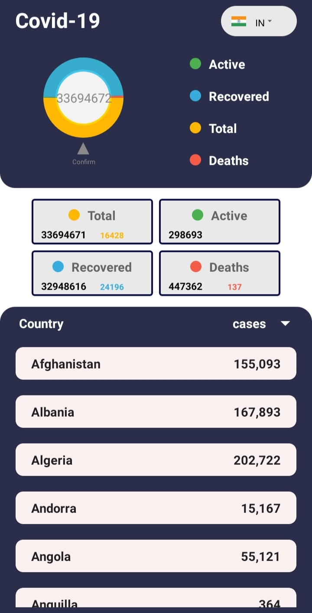
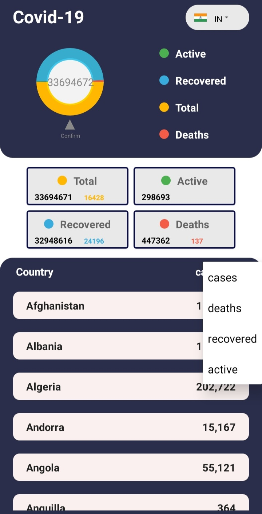
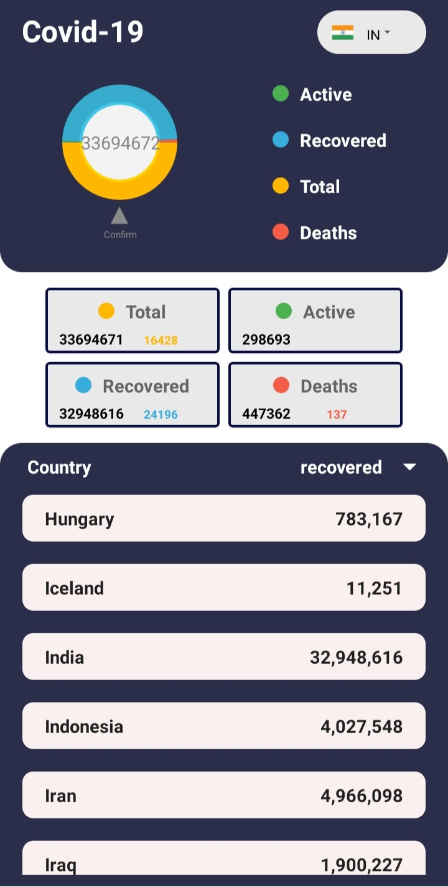
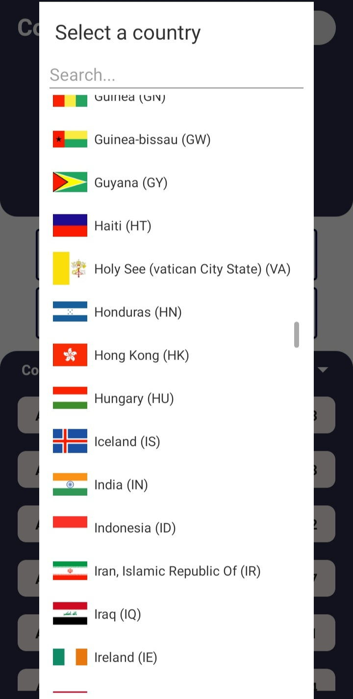

# COVID-19_Tracker-App (Preview) :-

This is a single screen 'Covid-19 tracking app' where user can view and filter COVID-19 cases based on country. The data from the API is 'LiveData' which constantly keeps updating.
The user can also view recovered cases, currently active cases, deaths, etc. The data can also be visualized through a pie chart.
This app is build using Kotlin programming language.
  
The concept's and libraries that are used for developing this app are: 
      1] Retrofit - A type-safe REST client used for making API calls 
      2] Recycler view - ViewGroup that contains the views corresponding to the data  
      3] Working With API's. (disease.sh - Worldwide Open Disease Data API)
  
      
      
## UI
<table>
   <tr>
    <td>View all cases</td>
    <td>Filter deaths, recovered, active</td>
    <td>View filtered data</td>
  </tr>
  <tr>
    <td></td>
    <td></td>
    <td></td>
  </tr>
 </table>
 
 
 
 ## Feature to Pick a Country
<table>
  <tr>
    <td>&nbsp;&nbsp;&nbsp;</td>
  </tr>
 </table>
